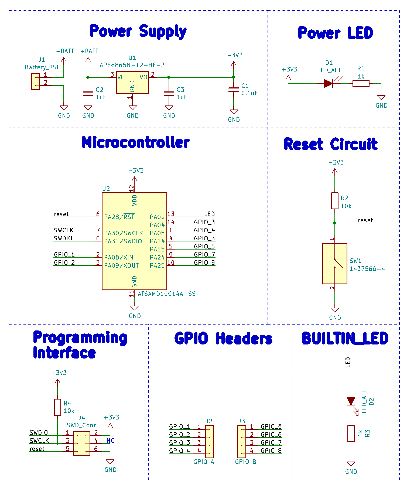
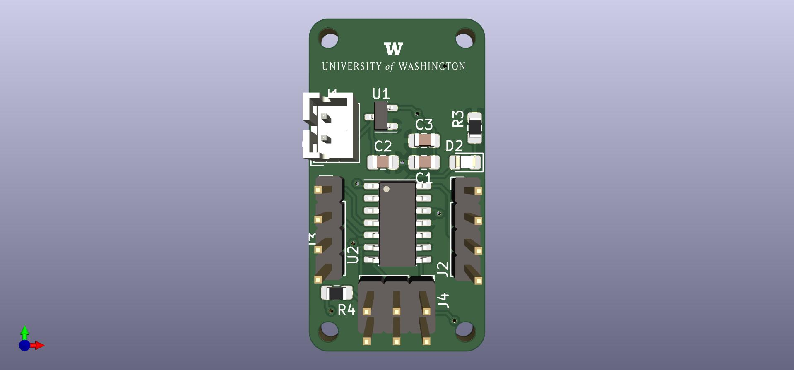
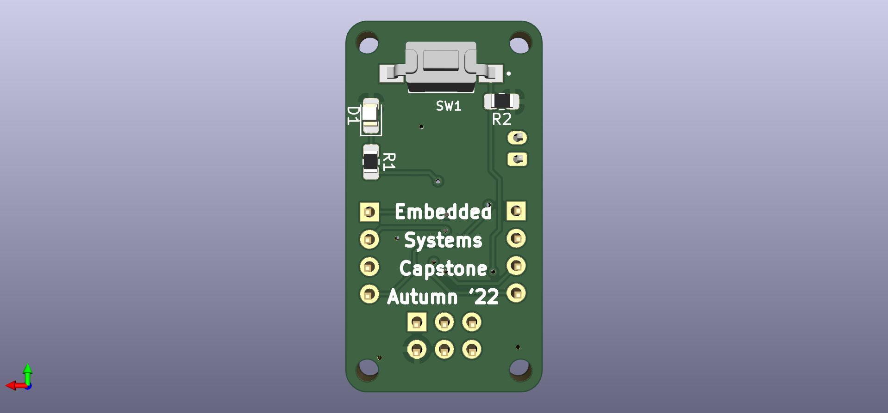

# 
 [CSE/EE 475] PCB Tutorial 

This repository contains all the files used for the PCB tutorial I taught in the Embedded Systems Capstone class. The base design was derived from the work of Mike's(MalphasWats) [**hawk**](https://github.com/MalphasWats/hawk) project. Hawk is well documented and highlights most concepts of PCB Design required for this class.

I made the following changes to the design to ensure a few other useful concepts were also covered:

- Added a different tactile switch to demonstrate the addition of external libraries, pull-ups
- Added a 'Builtin_LED' because it is a useful feature to have
- Moved the 'Tactile Switch and Builtin_LED' circuitry to the bottom layer to demonstrate component placement and routing on two layers
- Added 'GND' copper pour to top layer and '3V3' copper pour on bottom layer to demonstrate the use of copper pours
- Added UW logo on the top silkscreen layer to demonstrate the process of importing graphics into PCB
- Added text in the bottom silksreen layer to demonstrate the addition of useful text
- Generated Gerber files for the changes made above

The schematic with the changes looks like this:

Here's how the completed PCB looks like:

The slides used for the presentation can be found [here](https://docs.google.com/presentation/d/1yJ8d16ENtwlgDVSCv_pk9EhUhwFI2H66Mtzrn_bvfB8/edit?usp=sharing) and the dxf file imported into the design can be found [here](https://drive.google.com/file/d/1Wx1g2NUie0CLL9HZYDxmSbAbv8WsBbdb/view)
